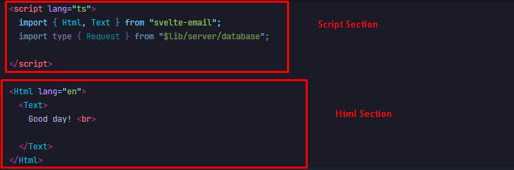

# Modifying Email Template

::: warning
The following section can be a little technical since it uses several programming and markup languages, but these will be explained as simply as possible.
:::

The following steps show how the hardcoded email template can be modified within the codebase. Note that afterwards, for the changes to be reflected within the app, the system must undergo [redeployment](/maintenance/redeployment).

The hardcoded email template is built as a Svelte component, named `ConfirmationEmail.svelte`. The file is located at

```text
/app/src/lib/components/email/ConfirmationEmail.svelte
```

## How to Modify the Template?

1. Open the codebase (the whole project folder) in any IDE or text editor, e.g. VS Code or Notepad++.
2. Find the file named `ConfirmationEmail.svelte`. As of writing, this should be located at `/app/src/lib/components/email/ConfirmationEmail.svelte`.
3. Open the file, you should then see the code divided into two sections:

   - the **script section** (within `<script lang="ts">...</script>`)
     - this contains the code to import data, which can then be inserted into the email
     - almost everything you need should already be imported, so you likely don't have to touch this part, except, for example, to add images
   - the **Html section** (within `<Html lang="en"><Text>...</Text></Html>`)
     - this contains the actual structure and format of the email template

   
   ::: tip
   The Html Section mostly uses basic HTML elements and the script section uses Typescript.
   :::

4. Modify each part of the template by following the guides in the [Script section](#script-section-guide) and [Html section](#html-section-guide).

## Script Section Guide

The script section uses basic Typescript syntax. Programming concepts are not needed, as this section is really only for importing _props_ (at least for the default email template). Think of these props as *prop*erties passed on to this component. Props are the data that we will be using. In the future, if the template needs further data processing, additional lines of code can be added to handle this (with Typescript).

::: info
Note that this guide will also cover the **fields** contained in each props. This way, if the template needs to include more information about the request in the future, you can refer back to this guide.
:::

In `ConfirmationEmail.svelte`, we can see two props declared. The word after `export let` is the variable name, and the word after the variable is its type.


1. `request` <br>
   The `request` prop is of type `Request` (please take note of the capitalization).
   The following fields in the table below are available for any data of type `Request`. You may refer to the codebase for the complete list of fields, but here are some that are likely to be useful.
   | Field | Type | Info | Usage |
   | ------------- | :-----------: | ---- | ---- |
   |`studentNumber`| string | This field contains the student number of the requester. (example: 2021-12345) | `request.studentNumber`|
   |`studentName`| string| This field contains the name of the requester. (example: Mikasa Dela Cruz)| `request.studentName`|
   |`studentEmail`| string | This field contains the email of the requester. (example: lackerman@aot.edu.ph) | `request.studentEmail`|
   |`purpose`| string | This field contains the purpose of the request. | `request.purpose`|
   |`remarks`| string | This field contains any remarks that came along with the request. | `request.remarks`|
   |`copies`| number | This field contains the number of copies the requester had requested. (example: 3) | `request.copies`|

   ::: info
   The syntax for obtaining a field value from a variable is `<variable_name>.<field>`, e.g. `request.purpose` where `request` is the variable name and `purpose` is the field.
   :::

2. `requestType` <br>
   The `requestType` prop is of type `RequestType` (please take note of the capitalization).
   The following fields in the table below are available for any data of type `RequestType`. You may refer to the codebase for the complete list of fields, but here are some that are likely to be useful.
   | Field | Type | Info | Usage |
   | ------------- | :-----------: | ---- | ---- |
   |`title`| string | This field contains the title of the request. (example: Official Transcript of Records (OTR) - First Request) | `requestType.title`|
   |`version`| number |This field contains the version number of the current request type. (example: 1) | `requestType.version`|

   ::: info
   The syntax for obtaining a field value from a variable is `<variable_name>.<field>`, e.g. `requestType.title` where `requestType` is the variable name and `title` is the field.
   :::

## Html Section Guide

The Html section mostly uses basic HTML elements, with exception of `Html`, `Text` and `Img`, which are imported from the `svelte-email` library. Note that other components from the `svelte-email` library can still be used (please visit [their documentation](https://svelte-email.vercel.app/docs/overview/svelte-email) for additional components). This section works like normal HTML, but for simplicity, `div` elements will not be included in the guide (everything will be written inline from top to bottom).

In `ConfirmationEmail.svelte`, we can see the default email template hardcoded along with some HTML elements. This section provides some of the basic elements that can be used.

| Element                          | Info                                                                                                                                                                    | Possible Usage                                                                              |
| -------------------------------- | ----------------------------------------------------------------------------------------------------------------------------------------------------------------------- | ------------------------------------------------------------------------------------------- |
| `<br>`                           | In HTML, despite hitting `Enter` on your keyboard, the text will still be on the same line. Thus, this is used to *br*eak the lines.                                    | `First Line <br> Second Line`                                                               |
| `<strong></strong>` or `<b></b>` | Any text written in between these tags will be displayed as **bold**.                                                                                                   | `normal text <strong>bold text</strong>`                                                    |
| `<u></u>`                        | Any text written in between these tags will be displayed with an <ins>underline</ins>.                                                                                  | `normal text <u>underlined text</u>`                                                        |
| `<span></span>`                  | This is just a span of space if you want to group a certain portion of text. This can be used to style them with inline CSS.                                            | `Your request for <span style="color:red">TCG</span> is ready for pickup.`                  |
| `<a href="..." ></a>`            | This element is used for adding links to texts. The link is added as the `href` property.                                                                               | `Watch the funny cat video <a href="https://www.youtube.com/watch?v=dQw4w9WgXcQ">here</a>.` |
| ``                  | This component is imported from the `svelte-email` library. The source `src` takes the `cid` of the image to be rendered. A `cid` is the unique identifier of the file. | Please see guide on [adding images to the template](#adding-images).                        |

::: tip
Note that in order to use dynamic data in our HTML, svelte lets us use the variable names enclosed in curly braces `{}` to render their values on to the elements. For example, if we want to display the value of a variable `x`, we do the following:

```svelte
<script lang="ts">
    let x = 12;
</script>

<Html lang="en">
    <Text>
        The value of x is {x}.
    </Text>
</Html>

```

This will be displayed as:

```
The value of x is 12.
```

This means that if someone named `Andre` has requested a `TCG` and his request data is stored in the variable `request`, then we can access different data specific to his request by doing the following:

```svelte
<script lang="ts">
    import { Html, Text } from "svelte-email";
    import type { Request, RequestType } from "$lib/server/database";

    export let request: Request;
    export let requestType: RequestType;
</script>

<Html lang="en">
    <Text>
        Good day, {request.studentName}! <br>
        Your request for {requestType.title} is ready for pickup.
    </Text>
</Html>
```

This will be displayed as:

```
Good day, Andre!
Your request for TCG is ready for pickup.
```

:::

## Adding Images

Adding images to the template requires a few additional steps. We will be using the `Img` component from the `svelte-email` library. This section will explain [how the QR code in the default template is added](#how-was-the-qr-code-image-added-in-the-email-template) and [how the approach can be generalized to support adding any number of images](#generalized-approach-for-adding-images-in-the-template), in case more images need to be included in the future.

### How was the QR Code image added in the email template?

1. The QR code image was put in the `/app/static/` folder, with filename `CSM_QR_CODE.png`.
   

2. An `Img` component was added in the template with a `cid` correctly set as this serves as the unique identifier for the image. The format for the content ID in the src of the image is `cid:<unique_identifier_here>`.

```svelte
<script lang="ts">
    import { Html, Text, Img } from "svelte-email";
    // script here...
</script>

<Html lang="en">
    <Text>
        Here is the QR Code<br>

        
    </Text>
</Html>
```

::: tip
Note that we are **not** importing anything within the script section that is related to the image itself, not even the image path. We are only setting a unique identifier (the `cid`) for the `src`. In this case. the `cid` we set for the qr code image is `qrcode`. This information will be used later in the next step.
:::

3. The page server script of the inbox route was then modified. The file is located at

```text
/app/src/routes/(dashboard)/inbox/+page.server.ts
```

In the `.../inbox/+page.server.ts`, we modified the `export const actions: Actions` object, particularly the `actions.finish_stage` async function. The `actions` object should follow the structure below.

```Typescript
export const actions: Actions = {
    add_request: async (event) => {/** Skip the code here */},
    finish_stage: async ({ request, locals, cookies, fetch }) => {
        /**
         *
         * Important Codes Here
         *
         */
    },
  rollback_stage: async (event) => {/** Skip the code here */},
  reassign_stage: async (event) => {/** Skip the code here */}
}
```

Here is what the `finish_stage` async function looks like (please expand the details container to see code).
::: details Structure of `actions.finish_stage` Async Function
Note that some of the code are commented out here so that only the important parts are emphasized, particularly, the code inside the `if (shouldSendEmail) {}` block. However, in the actual codebase, these lines are not commented out.

```Typescript
export const actions: Actions = {
    finish_stage: async ({ request, locals, cookies, fetch }) => {
            // const userId = locals.user?.id ?? "0";
            // const sessionId = cookies.get(lucia.sessionCookieName)!;
            // const data = await request.formData();
            // const requestId: string = data.get("requestId")?.toString() ?? "";
            // const nextHandlerId: string = data.get("nextHandlerId")?.toString() ?? "0";
            // const shouldSendEmail: boolean =
            // (data.get("shouldSendEmail")?.toString() ?? "false") === "true"
            //     ? true
            //     : false;

            // // Get Request and its RequestType
            // const {
            //     req: req,
            //     reqType: reqType,
            //     error: reqError,
            // } = await getRequestAndType(requestId);
            // if (!req || !reqType) {
            // setFlash(reqError, cookies);
            // return;
            // }

            if (shouldSendEmail) {
                const emailHtml = render({
                    template: ConfirmationEmail,
                    props: {
                        request: req,
                        requestType: reqType,
                    },
                });

                const imagePath = resolve("./static/CSM_QR_Code.png");
                const email: MailOptions = {
                    from: env.GOOGLE_SENDER_EMAIL,
                    to: req.studentEmail,
                    subject: `${reqType.title} has been finished`,
                    html: emailHtml,
                    attachments: [
                        {
                            path: imagePath,
                            filename: "qrcode.png",
                            cid: "qrcode",
                        },
                    ],
                };

                const sendEmail = async (mail: typeof email) => {
                    await new Promise((resolve, reject) => {
                        transporter.sendMail(mail, (err, info) => {
                            if (err) {
                                    console.error(err);
                            reject(err);
                            } else {
                                resolve(info);
                            }
                        });
                    });
                };

                await sendEmail(email);
            }

            // Check if the request still exists in active
            // Needed in case button is spammed
            // const requestExistsInInbox = await existsInInbox(userId, "current", {
            //     requestId,
            //     stageTypeIndex: req.currentStage.stageTypeIndex,
            // });
            // if (!requestExistsInInbox) {
            // setFlash(
            //     {
            //         type: "error",
            //         message: "Error. Stage not in active inbox",
            //     },
            //     cookies,
            // );
            //     return;
            // }

            // let result: any;
            // const onFinalStage =
            // req.currentStage.stageTypeIndex == reqType.stages.length - 1;

            // if (!onFinalStage) {
            //     const credentials = { sessionId, userId };
            //     await sendInboxNotification(
            //         {
            //         type: "NewStage",
            //         requestId,
            //         stageTypeIndex: req.currentStage.stageTypeIndex,
            //         },
            //         nextHandlerId,
            //         credentials,
            //         fetch,
            //     );

            //     result = await passRequest(req, reqType, nextHandlerId);
            // } else {
            //     result = await finishRequest(req);
            // }

            // setFlash(result, cookies);
    },
}
```

:::

Now, breaking this down, the code emphasized above can be looked at in 3 parts.

A. Here, we use the `render` function from the `svelte-email` library. This converts the svelte component into native HTML elements.

```Typescript
const emailHtml = render({
                template: ConfirmationEmail,
                props: {
                    request: req,
                requestType: reqType,
                },
            });
```

::: tip
This means that after the _render_ process, somewhere in the `emailHtml`, we should have a native `img` element with the unique `cid` in its source property, something like ``.
:::

B. This is the most important part of the code. While we know that the image is located in `./static`, we don't know how the server handles paths. Thus, we make use of `resolve()`. Basically, with the help of this function, we can convert a relative path into an absolute path.

```Typescript
const imagePath = resolve("./static/CSM_QR_Code.png");
const email: MailOptions = {
    from: env.GOOGLE_SENDER_EMAIL,
    to: req.studentEmail,
    subject: `${reqType.title} has been finished`,
    html: emailHtml,
    attachments: [
        {
            path: imagePath,       //Where the image is located
            filename: "qrcode.png",//Filename for the image in the email
            cid: "qrcode",         //Content ID used to embed the image in the email HTML
        },
    ],
};
```

::: tip
The `imagePath` variable contains the path to the image we are trying to embed in the template.
Note that `email.attachments` is of array structure. Thus, we can include multiple images in the template given that each of them will be provided proper `cid`. Moreover, we can add more variables for multiple image paths (if we want to embed multiple images), as shown below.

```Typescript
const imagePath1 = resolve("./static/img1.png");
const imagePath2 = resolve("./static/img2.png");

const email: MailOptions = {
    // ...
    attachments: [
        {
            path: imagePath1,
            filename: "image1.png",
            cid: "image1",
        },
         {
            path: imagePath2,
            filename: "image2.png",
            cid: "image2",
        },
    ],
};
```

Additionally, we can also set the subject for the email as shown in the code below.

```Typescript
const email: MailOptions = {
    // ...
    subject: "Email Subject Here",
    // ...
};

```

:::

C. The last part handles sending the emails.

```Typescript
 const sendEmail = async (mail: typeof email) => {
    await new Promise((resolve, reject) => {
        transporter.sendMail(mail, (err, info) => {
            if (err) {
                console.error(err);
                reject(err);
            } else {
                resolve(info);
            }
        });
    });
};

await sendEmail(email);
```

### Generalized Approach for Adding Images in the Template

Now, we want to generalize the process by providing an example since it is possible that in the future revisions of the template, multiple images are to be added. Thus, this subsection discusses how the approach can be generalized to support adding any number of images.

::: tip Example
Suppose we want to embed `n` number of images in our template. We do so by adding `n` number of `Img` components. The code below shows how the different `cid` are set to be unique from other images.

```svelte
<script lang="ts">
    import { Html, Text, Img } from "svelte-email";
    // script here...
</script>

<Html lang="en">
    <Text>
        Here is the 1st image. <br>
         <br>

        Here is 2nd image. <br>
         <br>

        ... <br>

        Here is nth image. <br>
         <br>
    </Text>
</Html>
```

In our server script, we should have the following:

```Typescript
export const actions: Actions = {
    // ...
    finish_stage: async ({ request, locals, cookies, fetch }) => {
        //...
        if (shouldSendEmail) {
            // render svelte component here

            const imagePath1 = resolve("./static/image_1.png");
            const imagePath2 = resolve("./static/image_2.png");
            // ...
            const imagePathN = resolve("./static/image_n.png");

            const email: MailOptions = {
                from: env.GOOGLE_SENDER_EMAIL,
                to: req.studentEmail,
                subject: "Email with multiple embedded images!",
                html: emailHtml,
                attachments: [
                    {
                        path: imagePath1,
                        filename: "filename_1.png",
                        cid: "unique_1",
                    },
                    {
                        path: imagePath2,
                        filename: "filename_2.png",
                        cid: "unique_2",
                    },
                    //...
                    {
                        path: imagePathN,
                        filename: "filename_n.png",
                        cid: "unique_n",
                    },
                ],
            };

            // send email handler here
        }
        //...
    }
    // ...
}
```

With the code blocks above, `image_1.png` will be embeded on the spot where the `Img` component has a `cid` of `unique_1`, same goes for `image_2.png` until `image_n.png`.

:::
